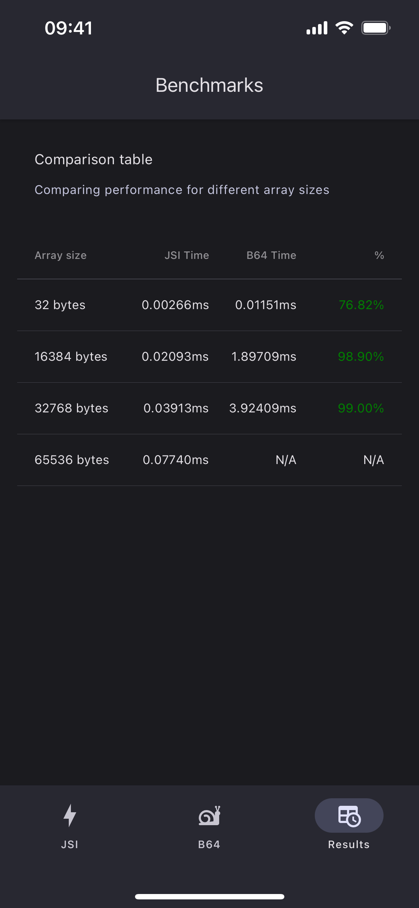
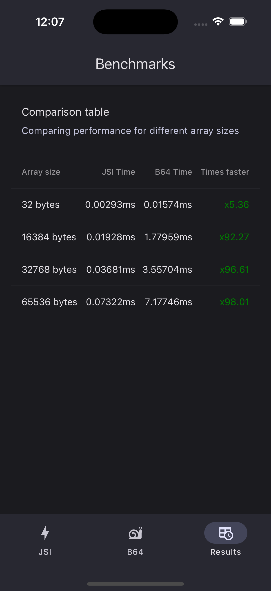

<a>
  <picture>
    
  </picture>
</a>

---

[](https://www.npmjs.com/package/@korekoi/react-native-get-random-values)

### Features

- 🫳 Drop-in replacement for `crypto.getRandomValues`
- ⚡ Uses JSI for faster operations  between Native and JS
- 🔒 Native C++ secure randomization using [libsodium](https://github.com/jedisct1/libsodium)

### Installation

```sh
npm install @korekoi/react-native-get-random-values
```

#### Dependencies

This library needs these dependencies to be installed in your project before you can use it:

```sh
npm install react-native-nitro-modules
```

### Usage

```typescript
import "@korekoi/react-native-get-random-values"

const array = new Uint8Array(32);
global.crypto.getRandomValues(array);
```


> See the [example app](./example/)

### How does it compare to other alternatives?

The most downloaded and probably the only available library to polyfill this method (until now) has been [LinusU/react-native-get-random-values](https://github.com/LinusU/react-native-get-random-values), but our solution has a couple improvements:

- **JSI**, Native and JavaScript communicate through a memory reference and not by serializing data in Base64 back-and-forth, which results in faster operations
- Randomization is made using [libsodium](https://github.com/jedisct1/libsodium) for both iOS and Android
  - instead of [Java SecureRandom](https://docs.oracle.com/javase/8/docs/api/java/security/SecureRandom.html) for Android and [Objective-C SecRandomCopyBytes](https://developer.apple.com/documentation/security/secrandomcopybytes(_:_:_:)?language=objc) or [Swift SecRandomCopyBytes](https://developer.apple.com/documentation/security/secrandomcopybytes(_:_:_:)) for iOS

### Benchmark

Percentage represents how much faster JSI is compared to B64

| iOS                                                                          | iOS Simulator                                                               | Android                    |
| ---------------------------------------------------------------------------- | --------------------------------------------------------------------------- | -------------------------- |
|  |      | Feel free to open an issue |
| iPhone 13 on iOS 17                                                          | iPhone 16 Pro Simulator, iOS 18, running on an MacBook Air M1 2020 16GB ram |                            |
| 10k loops at 65535 bytes with Base 64 crashed the app                        |                                                                             |                            |


### Notes

- [Get started with the development of the module](./docs/getting-started.md)
